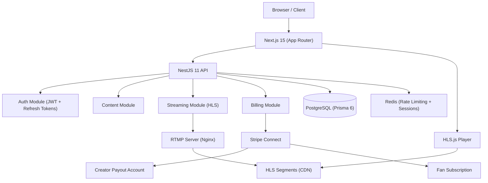

# SkyLive — Creator Platform & Live Streaming

> The all-in-one platform for creators: go live, share exclusive content, and monetize your audience with subscriptions and pay-per-view.

[](https://github.com/Maeglin10/skylive/actions/workflows/ci.yml)
[](LICENSE)
[](https://nextjs.org)
[](https://nestjs.com)

## What is SkyLive?

SkyLive is a premium content platform for independent creators. Think of it as the intersection of Twitch (live streaming), OnlyFans (exclusive content), and Patreon (fan subscriptions) — built from scratch with a modern stack.

**Creators** upload exclusive content, go live, and earn through tiered fan subscriptions and pay-per-view.
**Fans** follow creators, subscribe to tiers, chat live, and access premium content.

---

## Features

| Feature | Status |
|---------|--------|
| Creator profiles & public pages | ✅ Complete |
| Live streaming (HLS pipeline) | ✅ Architecture ready |
| Fan subscription tiers | ✅ Wired with Stripe |
| Creator studio & analytics | ✅ Complete |
| Content feed (exclusive + public) | ✅ Complete |
| Live chat (real-time) | ✅ Complete |
| Search & discovery | ✅ Complete |
| Admin dashboard | ✅ Complete |
| Affiliate program | ✅ Complete |
| Creator payouts (Stripe Connect) | ✅ Wired |
| Pay-per-view content | 🔜 v2.0 |
| Mobile apps (iOS/Android) | 🔜 v2.0 |

---

## Architecture



---

## Tech Stack

| Layer | Technology |
|-------|-----------|
| **Frontend** | Next.js 15, React 19, TailwindCSS, shadcn/ui, Framer Motion |
| **Backend** | NestJS 11, TypeScript 5.8, Fastify |
| **Database** | PostgreSQL + Prisma 6 |
| **Streaming** | Nginx RTMP → HLS pipeline |
| **Payments** | Stripe Connect (creator payouts + fan subscriptions) |
| **Real-time** | WebSocket (live chat) |
| **Auth** | JWT + Refresh Token Rotation |
| **Security** | Rate limiting (Redis-backed), ThrottlerGuard, helmet |
| **Monitoring** | Sentry (error tracking) |
| **E2E Tests** | Playwright |

---

## Monetization Model

```
Fan pays €9.99/mo subscription
    → Platform keeps 10% (€1.00)
    → Creator receives 90% (€8.99)
    → Paid weekly via Stripe Connect
```

Subscription tiers:
| Tier | Price | Access |
|------|-------|--------|
| **Fan** | Free | Public content only |
| **Supporter** | €4.99/mo | Exclusive content + DMs |
| **VIP** | €14.99/mo | All content + live priority + badge |

---

## Quick Start

### Prerequisites
- Node.js ≥ 20, pnpm ≥ 9
- PostgreSQL + Redis
- (Optional) Nginx with RTMP module for live streaming

```bash
# 1. Clone
git clone https://github.com/Maeglin10/skylive.git
cd skylive

# 2. Install
pnpm install

# 3. Configure
cp apps/api/.env.example apps/api/.env
cp apps/client/.env.example apps/client/.env.local
# Fill in your credentials

# 4. Database
cd apps/api
npx prisma migrate dev
npx prisma db seed

# 5. Run
cd ../..
pnpm dev
# API:    http://localhost:3001
# Client: http://localhost:3000
```

---

## Environment Variables

**`apps/api/.env`**
```env
DATABASE_URL=postgresql://...
JWT_SECRET=your-secret
REDIS_URL=redis://localhost:6379
STRIPE_SECRET_KEY=sk_test_...
STRIPE_WEBHOOK_SECRET=whsec_...
```

**`apps/client/.env.local`**
```env
NEXT_PUBLIC_API_URL=http://localhost:3001
NEXT_PUBLIC_STRIPE_PUBLISHABLE_KEY=pk_test_...
SENTRY_DSN=https://...  # optional
```

---

## Live Demo

🚀 **[Live at skylive.vercel.app](https://skylive.vercel.app)** (deployed on Vercel)

Demo accounts:
- Creator: `demo-creator@skylive.com` / `demo1234`
- Fan: `demo-fan@skylive.com` / `demo1234`

---

## Contributing

1. Fork the repo
2. `git checkout -b feat/your-feature`
3. `pnpm lint && pnpm test`
4. Open a PR — CI runs automatically

---

## License

MIT © [Valentin Milliand](https://github.com/Maeglin10)
